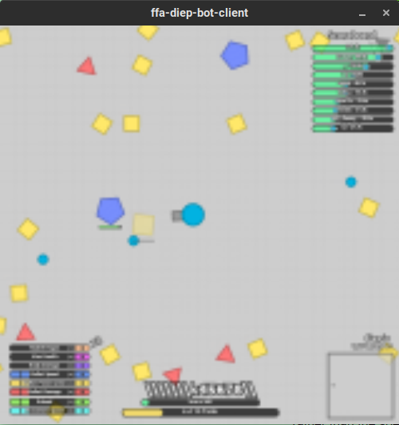

# ffa-diep-bot
A simple diep.io autoplay bot based on puppeteer.

The bot only functions properly in ffa-like gamemodes, such as sandbox, maze, and ffa. The bot can also only farm squares, and has trouble fighting spam tanks. The bot also only use the Basic tank.

# Prerequisites

* NodeJS 12+
* Python 3+

# Usage

Run `npm install` to install all the bot dependencies. If you get any errors, try deleting package-lock.json. To use the bot, run `node bot.js`. To watch the bot, you must set up the client. Run `pip install pygame` to install the bot client dependencies, and run `python client.py` to execute the client.

# Screenshots

